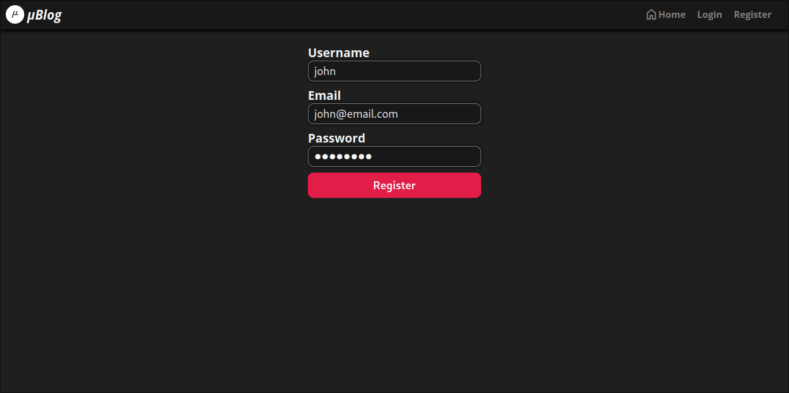
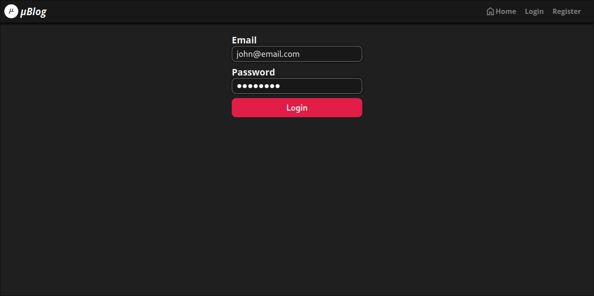
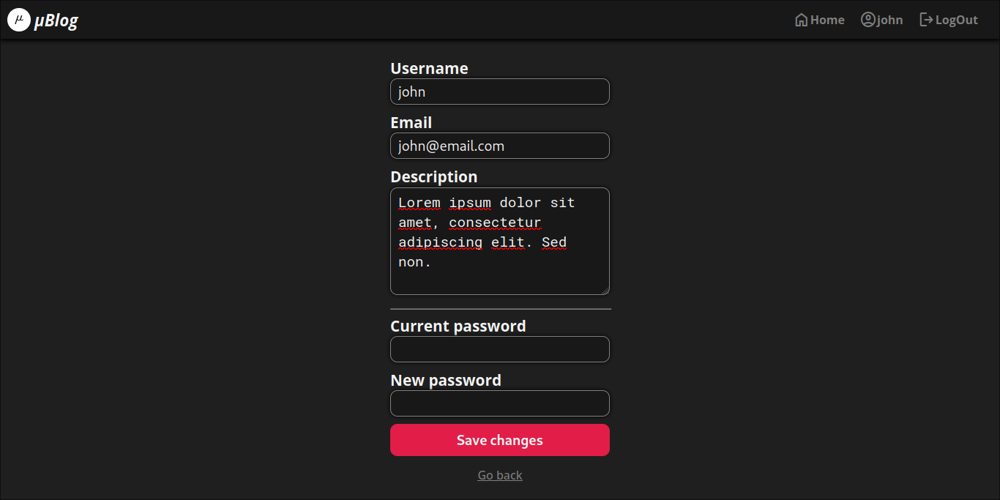
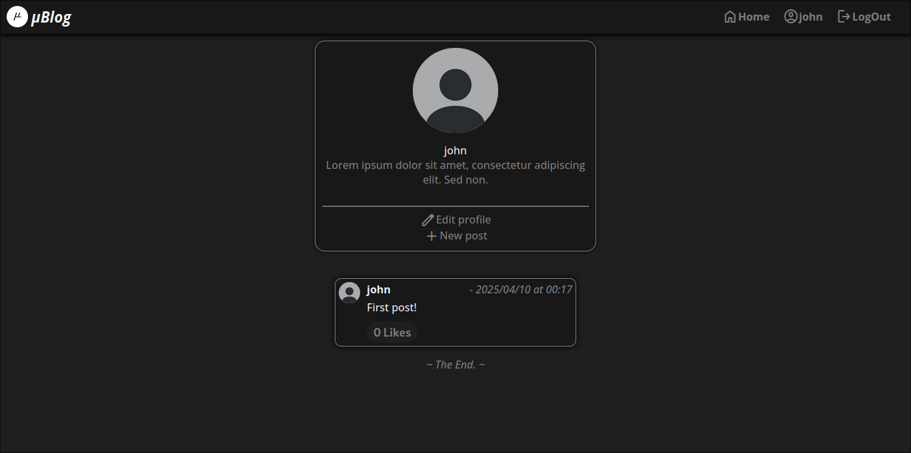
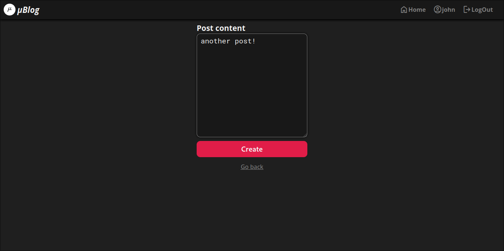
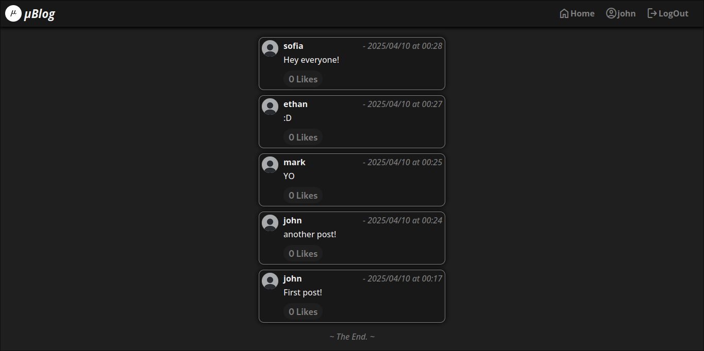
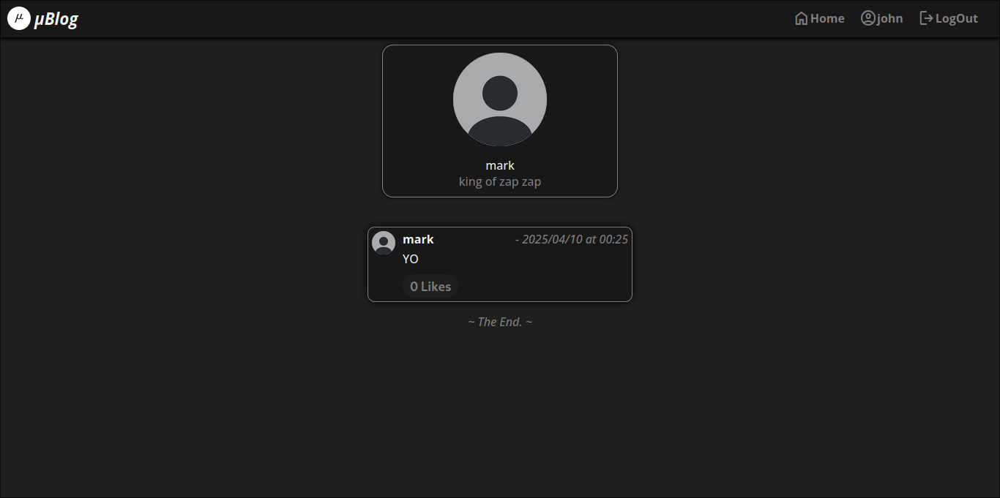

# μBlog

*μBlog* is an **ASPNET Core MVC** application developed for learning about web development, including front-end and back-end technologies, user authentication, and database management.

***The project is still in development.***

## Sumary

* [Description](#description)
* [Features](#features)
* [Technologies](#technologies)
* [Controllers](#controllers)
* [Gallery](#gallery)

---

## Description

A microblogging application is a platform for sharing short content, usually with a character limit. It allows quick communication through posts, images, and links. Examples include Twitter and Tumblr, featuring user interactions like comments, likes, and hashtags for categorization. It's commonly used for real-time updates and discussions.

The idea behind this project is to create a microblog-like application to learn about ASPNET. 

This application will serve as a hands-on platform for exploring key concepts such as user authentication, database integration, and real-time updates.

---

## Features

- [x] Account registration, login, and profile editing
- [x] Post creation
- [x] Ability to like user posts
- [x] View other users profiles
- [ ] Account deletion
- [ ] Post editing and deletion
- [ ] Search for other users profiles
- [ ] Post comments
- [ ] Follow users

---

## Technologies

### Front-End

* HTML
* CSS
* JavaScript
* JQuery

### Back-End

* .NET 9.0
* ASPNET Identity
* Entity Framework
* SQLite3

---

## Gallery

